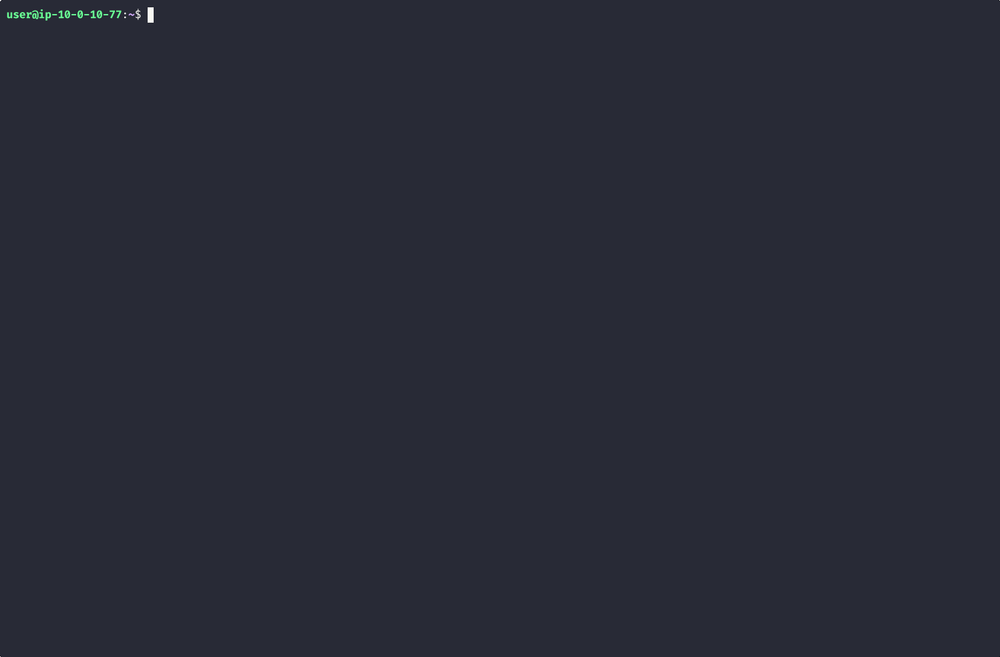
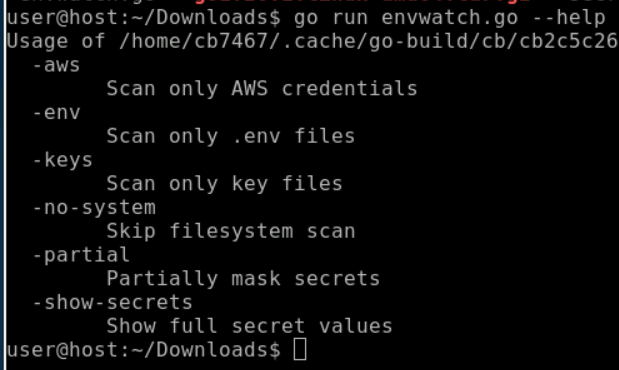
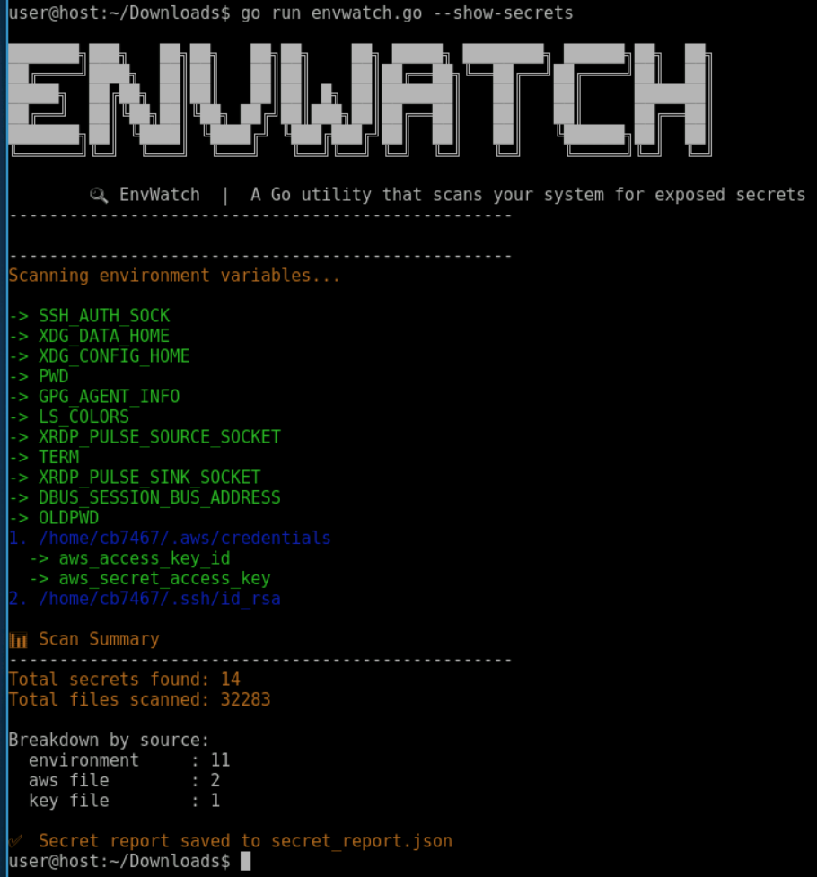
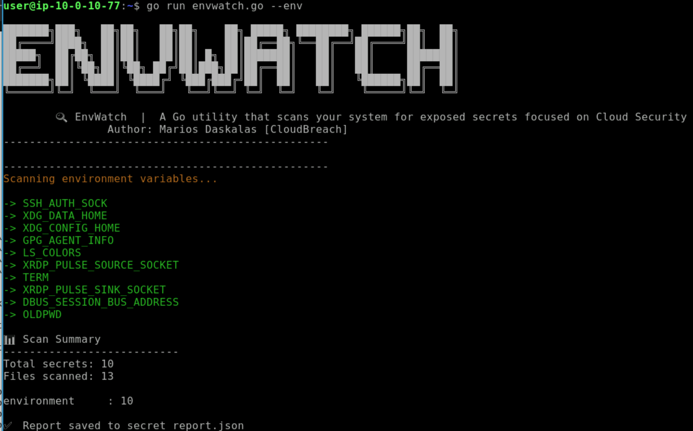
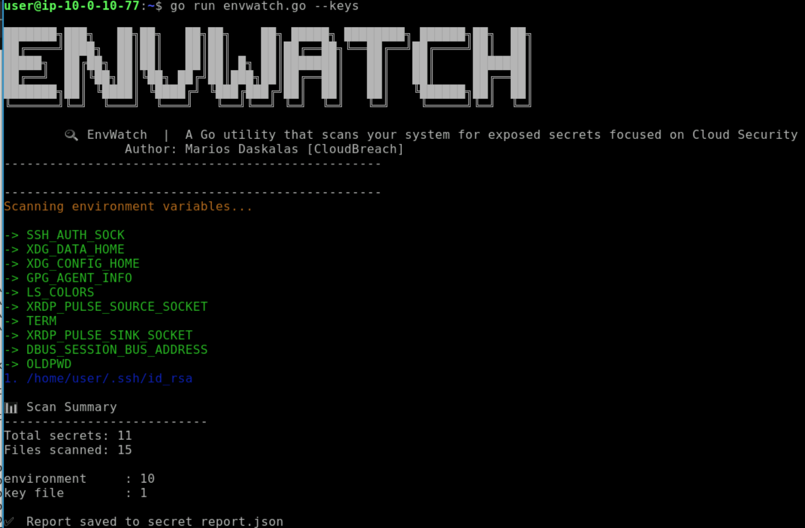
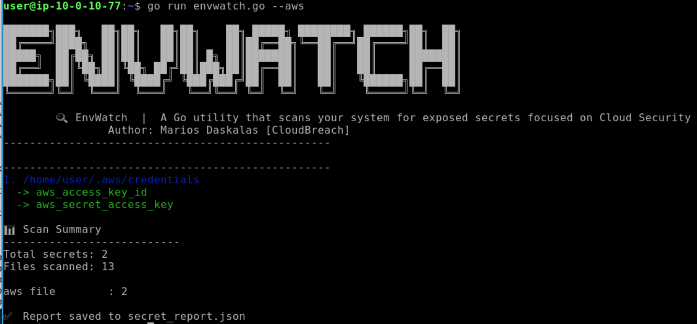

# 🔍 EnvWatch

**EnvWatch** is a lightweight Go utility that scans your system for potentially exposed secrets such as API keys, passwords, private keys, and AWS credentials.

It helps developers and security-conscious users quickly identify sensitive data leaks across environment variables, config files, and the filesystem.

## 🚀 Features

* 🔎 Scan environment variables for secrets
* 📁 Detect secrets inside `.env` files
* 🔐 Identify private key files (`.pem`, `.key`, SSH keys)
* ☁️ Scan AWS credentials/config files
* 🧠 Entropy-based secret detection (finds hidden/random tokens)
* 🎯 Flexible filtering via CLI flags
* 📊 JSON report generation
* 🎨 Colored terminal output (auto-disabled when piped)

## 📦 Installation

```bash
git clone https://github.com/cloudbreach/EnvWatch.git
cd envwatch
go run envwatch.go --help
```

## ▶️ Usage

```bash
go run envwatch.go --help
```

### Available Options

| Flag             | Description               |
| ---------------- | ------------------------- |
| `--env`          | Scan only `.env` files    |
| `--keys`         | Scan only key files       |
| `--aws`          | Scan only AWS credentials |
| `--no-system`    | Skip filesystem scan      |
| `--show-secrets` | Show full secret values   |
| `--partial`      | Partially mask secrets    |
| `--help`         | Show help menu            |


## 🧪 Examples

Scan everything:

```bash
go run envwatch.go --show-secrets
```

Scan only `.env` files:

```bash
go run envwatch.go --env
```

Show partially masked secrets:

```bash
go run envwatch.go --partial
```

Show full secrets (⚠️ sensitive):

```bash
go run envwatch.go --show-secrets
```

## 🛠 How It Works

EnvWatch uses two main approaches:

### 1. Keyword Detection

It searches for variable names containing common secret-related terms:

* `PASSWORD`
* `SECRET`
* `TOKEN`
* `API_KEY`
* `PRIVATE_KEY`
* etc.

### 2. Entropy Analysis

It calculates the **Shannon entropy** of values to detect random-looking strings that may indicate secrets.

## 📂 Scan Targets

* Environment variables (`os.Environ`)
* `.env` files across your home directory
* SSH directory (`~/.ssh`)
* AWS credentials:

  * `~/.aws/credentials`
  * `~/.aws/config`
* Files ending in:

  * `.env`
  * `.pem`
  * `.key`


## 📊 Output

### Terminal Output

* Displays detected secrets grouped by file/source
* Color-coded for readability

### JSON Report

A file named:

```
secret_report.json
```

Contains:

```json
{
  "stats": {
    "total_secrets": 10,
    "files_scanned": 120,
    "by_source": {
      "environment": 3,
      ".env file": 5,
      "key file": 2
    }
  },
  "secrets": [
    {
      "source": "environment",
      "file": "system",
      "variable": "API_KEY",
      "value": "[REDACTED]"
    }
  ]
}
```

## 🔐 Security Notes

* By default, secrets are **fully redacted**
* Use `--partial` or `--show-secrets` with caution
* Avoid sharing generated reports publicly if secrets are exposed

## 🧩 Comming Next
* [ ] Git repository scanning
* [ ] Ignore/include path filters
* [ ] Custom keyword configuration 
* [ ] Real-time monitoring mode
* [ ] Export formats (CSV, HTML)

## 📜 License

This project is licensed under the MIT License.

## Contribute

Feel free to create a Pull Request if you have any ideas or features you would like to add.

## 💡 Inspiration

Built to simplify secret discovery and reduce accidental leaks during development and deployment.

[]()

## Blog

For a deeper dive into the methodology behind the tool and why securing `.env` files is critical, check out our full write-up: 🔗 [EnvWatch - Find Exposed Secrets Before Hackers Do](https://cloudbreach.io/blog/envwatch-find-exposed-secrets-before-hackers-do)

## Demo

See EnvWatch in action. The demonstration below shows how quickly the tool can scan and identify exposed secrets in real-time:


## Screenshots







## Author

Marios Daskalas
